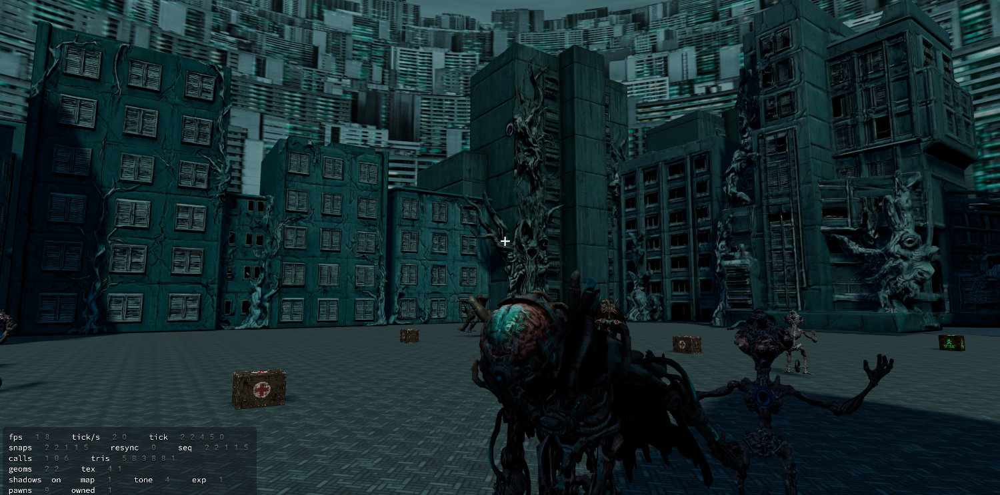

# Conveyor Engine Arena



A one-room browser arena for [Conveyor Engine](https://github.com/autonomous1/conveyor-engine-packages). A Node host owns the simulation and publishes snapshots over a same-origin WebSocket. A Three.js client renders those snapshots: floor, four facade walls, cover, a city cylinder, a sky dome, and wandering characters.

The server ticks at 20 Hz. Each spawn point gets a pawn. The wander loop picks `idle`, `walk`, `run`, `fall`, or `angry`, plays that clip, and scales movement by that gait’s speed relative to the fastest gait on the model. Connecting a browser assigns a free pawn, and the camera stays a free-fly view.

## Prerequisites

Node.js 22 or newer. This repo expects three sibling checkouts, because `package.json` uses `file:` dependencies:

```text
~/dev/conveyor-engine-arena/          this repo
~/dev/conveyor-engine-packages/       kernel (dependencies)
~/dev/conveyor-graph/                 devDependency
~/dev/conveyor-graph-simulator/       devDependency
```

Those packages publish from `dist/`. Build them before `npm install` here when that output is missing. The live server publishes snapshots on its own. `conveyor-graph-simulator` is used by the headless runners, the bench, and `record:arena`.

## Run

```bash
npm install
npm run dev
```

`npm run dev` builds the server and the browser bundle, then starts the host. The process prints a line like:

```json
{"url":"http://127.0.0.1:4173","ws":"ws://127.0.0.1:4173"}
```

Open that URL. The host binds to `127.0.0.1`. Set `PORT` to use another port. After a build, `npm start` launches `dist/server/main.js` without rebuilding.

`viewer/serve.mjs` exits and points at `npm start`. Static files come from `dist/web`. `/arena.json` is generated in memory from the compiled game file. Paths outside that bundle, including source maps, `node_modules`, and `/pkg`, respond with 404.

## Controls

The camera uses Three.js first-person fly controls:

| Input | Action |
| --- | --- |
| W / Up, S / Down | Forward, back |
| A / Left, D / Right | Strafe |
| R, F | Up, down |
| Drag | Look |

A gamepad flies the same camera. The right stick is inverted relative to the `three-gamepad-controls` default. Pawn intent is still driven on the server.

A status line at the top shows the connection and how many pawn meshes fell back to capsules.

## Game file

`web/game/arena.game.json` is the authored game (`bundleId` `arena.one-room.v1`, `worldVersion` `example-v1`). On startup the server compiles it into the static world and the `/arena.json` view the client renders. A bad manifest stops startup with a field path and a message: invalid version, a path that escapes `web/`, a missing file, a model that is not a GLB, or a spawn that intersects an obstacle.

`scene.id` and `scene.bounds` are required. `floor`, `walls`, `sky`, `cityscape`, `shadows`, `spawnPoints`, `props`, `collision`, and `placements` are optional. A missing block is left out: no facade slots without `walls`, no backdrop without `sky` or `cityscape`, and no stand-in for a missing floor or shadow setting. Missing spawn points leave the host fallback spawn in place. When `walls` is present, each of `south`, `east`, `north`, and `west` names a model asset, and collision ids 10–13 are reserved for those boxes.

`scene.bounds` is the bounds object, or a path to a JSON file of that object. `scene.spawnPoints` is the spawn array, or a path to a JSON file of that array. A path uses the same rules as a placements file: relative to the arena repo, or into the sibling blueprint-scene checkout. A missing file fails the load.

`scene.placements` is a list of placements files. A single path string is accepted as a one-element list. Each file's placements and obstacles are concatenated, and ids must be unique across files. A missing file fails the load. A placement file may also carry `scene.spawnPoints`, `scene.props`, and `scene.collision`, which are appended. It does not replace `floor`, `sky`, `cityscape`, `shadows`, or the manifest `bounds`.

`scene.shadows.quality` is `off`, `basic`, `soft`, or `realistic`. `realistic` is a 4096 variance shadow map, `soft` is PCF at 2048, and `basic` is an unfiltered 512 map.

Character models map `idle`, `walk`, `run`, `fall`, and `angry` to a GLB clip name, or to `{ "clip", "speed" }`. Omitted speeds default to idle 0, walk 1, run 2, fall 0, angry 0. Clip lookup uses the exact name, then a case-insensitive substring. A positive finite `scale` (default 1) is applied to the character template before pawns spawn. A missing or failed character model draws a capsule and leaves the simulation hash unchanged.

Two hashes ride along in the view:

- `authoritativeHash` covers collision, spawns, bounds, and visual layout identity. Changing walls, cover, or spawns changes it, and connected clients must reconnect.
- `presentationHash` covers texture and model bytes. Swapping those files leaves the authoritative hash alone.

Each asset keeps its own license id and provenance origin.

## Scripts

| Script | What it does |
| --- | --- |
| `npm run dev` | Build, then start the live host |
| `npm start` | Start `dist/server/main.js` |
| `npm run build` | Clean `dist/`, compile the server with `tsc`, bundle the client with esbuild |
| `npm run typecheck` | Typecheck server and client without emitting |
| `npm test` | Node’s test runner. Requires a prior `npm run build` |
| `npm run start:arena` | Headless arena for 8 ticks (pass a count: `npm run start:arena-wall` runs 40) |
| `npm run start:arena-miss` | Same path with presentation assets marked missing |
| `npm run run:lossless` | Headless runner, clean delivery |
| `npm run run:lossy` | Headless runner, loss and jitter |
| `npm run run:partition` | Headless runner, a temporary partition |
| `npm run bench` | Headless bench, default 200 entities and 30 ticks (`npm run bench -- 1000 120`) |
| `npm run record:arena` | Record a wander trace with the simulator to `viewer/replay/arena-wander.jsonl` |

`node scripts/make-placeholders.mjs` writes original procedural stand-ins under `web/assets` (stone floor, cloudy sky, crate and player GLBs). The game file is what the server loads; point an asset `uri` at a new file for it to appear in the room.

## Layout

```text
src/server/     HTTP host, manifest compile, world load, wander tick
src/client/     Browser bootstrap, scene, pawn presentation, camera, HUD
src/shared/     Arena view, movement names, shadow settings
src/            Headless ExampleApp, runners, bench, wander recording
web/game/       arena.game.json
web/assets/     Models and textures copied into dist/web
web/index.html  Page shell
scripts/        Client bundle and placeholder art
test/           Manifest, host, movement, shadows, wall mount, static world
dist/           Build output. The host serves dist/web and runs dist/server
```

## Tests

```bash
npm run build
npm test
npm run typecheck
```

`npm test` uses `node --experimental-strip-types`. Several tests import the built `dist/` modules, and the host test requests `/` and `/client.js`, so run a full build first.
